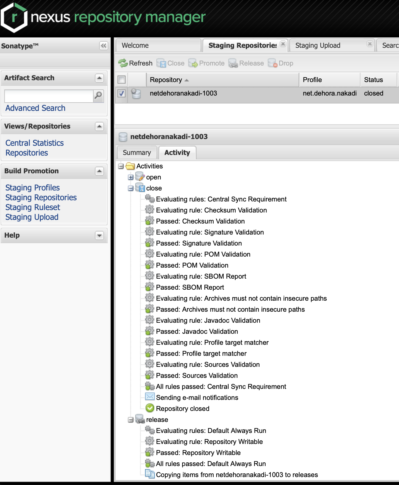

# Releasing

**1: Create an X.Y.Z branch and PR**. 

Here's the one for [0.16.0](https://github.com/dehora/nakadi-java/pull/366). 
Update the README, CHANGES, gradle.properties and Version.java files. Pass 
the build and rebase merge to main.

**2: Create a release tag on GH**.

Once the release PR is merged, create a release tag. The tag name should be the version 
name (eg '0.16.0'), the title should be the same, and the content should be the relesase 
notes from the CHANGES file.

**3: Push to Sonatype**.

Once the release PR is merged, pull the main branch and run 

```bash
./wgradle publishToMavenLocal
```

check the artifacts build ok (the shadow jar, asc, pom files should all be there):

```bash
open ~/.m2/repository
```

Then publish to sonatype:

```bash
./wgradle publish
```

The gradle publishing task relies on credentials outside the project.

**4: Release**.

Go to https://oss.sonatype.org and to 'stagingRepositories'. There will be a new 
project. To run it click the "Close" button at the top. This will run a validation
that will take a while to run.  Either everything is fine and you can proceed, or 
there will be  errors: if so, click "Drop" to rm the staging repo and repeat the 
process (cli "publish" and ui "close") again when it's fixed.



If everything is fine, the next step is to release the artifacts by clicking the 
"Release" button for the closed staging repo. It will take a while, at least 
minutes for the artifacts to appear in Central(https://repo1.maven.org/maven2) and 
search (https://search.maven.org) can take hours to update. Once the release runs 
ok, the staging repo will be removed from 'stagingRepositories'.


